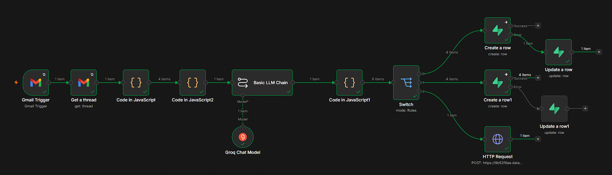

# UCIC Email Insights — Group Email Summarizer & Insights Generator

A single-view dashboard that reads email group conversations, extracts tasks/owners/due-dates,
and lets a business head search past decisions and bottlenecks in plain English.

Built for the UCIC case study (Task Segments 1 & 2).

---

## Architecture

```
Gmail (email group)
    │
    ▼
 n8n workflow (ingestion connector)
    Gmail Trigger → Get Thread → parse messages → Groq (Llama 3.3 70B)
    → structure JSON → Switch (create/update) → Supabase (realdb + tasks)
    │
    ▼
 Supabase (Postgres)              Neo4j Aura (graph)
   - realdb  : raw emails            - Thread / Person / Topic / Department / Task nodes
   - tasks   : extracted tasks        - relationships: SENT, PARTICIPATED_IN, OWNS, ABOUT, EXTRACTED_FROM
    │                                     │
    └───────────────┬─────────────────────┘
                     ▼
            Dash + Dash Bootstrap Components (UI)
              - Dashboard  (KPIs, charts)
              - Tasks      (filterable task table)
              - Knowledge Repository (NL question → Cypher via
                langchain-neo4j GraphCypherQAChain + Groq → answer)
```

A parallel **Demo** data path (`csv_to_demo_pipeline.py`) replays the same extraction logic
against the provided synthetic dataset (`ucicdemo.csv`) into a local SQLite file (`demo.db`)
and a demo Neo4j graph, so the dashboard is fully explorable without live Gmail/Supabase access.
A sidebar toggle switches between **Demo (synthetic)** and **Live (Supabase)** at runtime.

---

## Tech stack

| Layer                 | Tool                                                      | Why                                                                                        |
| --------------------- | --------------------------------------------------------- | ------------------------------------------------------------------------------------------ |
| Ingestion / connector | **n8n**                                                   | Gmail Trigger → thread fetch → LLM structuring → Supabase write, on a schedule             |
| Structured data       | **Supabase (Postgres)**                                   | Source of truth for raw emails (`realdb`) and extracted tasks (`tasks`)                    |
| Relationship data     | **Neo4j Aura**                                            | Graph of People / Threads / Topics / Departments / Tasks, powers the knowledge repository  |
| LLM                   | **Groq — Llama 3.3 70B**                                  | Thread summarization, task/owner/due-date extraction, natural-language → Cypher generation |
| RAG orchestration     | **langchain-neo4j (GraphCypherQAChain) + langchain-groq** | Turns a plain-English question into Cypher, runs it, explains the result                   |
| Dashboard UI          | **Dash + Dash Bootstrap Components**                      | KPI cards, charts (Plotly), task table, query box                                          |
| Hosting               | **Render**                                                | Free-tier web service running `gunicorn app:server`                                        |

---

## Task Segment 1 — Connectors & ingestion

Implemented in **n8n** (see `n8n_workflow.json` and the screenshot below):

1. **Gmail Trigger** — watches the target email group inbox
2. **Get a thread** — pulls the full thread for context, not just the single new message
3. **Code (JavaScript, x2)** — reshapes the thread into a clean array of `{sender, timestamp, body}`
4. **Basic LLM Chain + Groq Chat Model** — sends the full thread to Llama 3.3 70B with a structured
   prompt (see `SYSTEM_PROMPT` in `csv_to_demo_pipeline.py` for the equivalent used in the demo path)
   asking for: thread title, department, category, topic, priority, summary, and a list of tasks
   (each with description, owner, due date, status)
5. **Code (JavaScript)** — splits the LLM's JSON output into email rows + task rows
6. **Switch** — routes to "create" vs "update" depending on whether the email/task already exists
7. **Create/Update row (x2 pairs) + HTTP Request** — writes into Supabase `realdb` and `tasks` tables,
   and pushes the same structured payload to the Neo4j graph via an HTTP endpoint



This satisfies all three points of Task Segment 1: reading group email, summarizing threads with
task/owner/due-date extraction, and scheduled ingestion (Gmail Trigger polls on an interval).

---

## Task Segment 2 — Dashboard & knowledge repository

**Dashboard** (`/`): Open Tasks, Overdue Tasks, Active Threads, Total Emails (KPI cards);
Tasks by Owner, Priority Breakdown, Active Discussion Topics, Conversation Volume Trend (charts);
filterable by Department.

**Tasks** (`/tasks`): full task table with All / Open / Overdue filters, sortable and searchable.

**Knowledge Repository** (`/knowledge`): free-text question box. A `GraphCypherQAChain`
(langchain-neo4j + Groq) converts the question into Cypher, runs it against the graph, and
returns a plain-English answer grounded in the actual thread data — covering decisions,
bottlenecks, and lessons learned across historical threads.

---

## Running locally

```bash
git clone https://github.com/06DhanushBE/Group-Email-Summarizer-Insights-Generator.git
cd Group-Email-Summarizer-Insights-Generator

python -m venv .venv
.venv\Scripts\activate        # Windows
pip install -r requirements.txt
```

Create a `.env` file (see `.env.example` if provided, or the variable names in `app_config.py`):

```
SUPABASE_URL=...
SUPABASE_KEY=...

DEMO_NEO4J_URI=...
DEMO_NEO4J_USERNAME=...
DEMO_NEO4J_PASSWORD=...

NEO4J_URI=...              # optional, for Live mode's knowledge repository
NEO4J_USERNAME=...
NEO4J_PASSWORD=...

GROQ_API_KEY=...
GROQ_MODEL=llama-3.3-70b-versatile
```

`demo.db` is already committed, so **Demo mode works immediately** with no extra setup.
To rebuild it from scratch: `python csv_to_demo_pipeline.py` then `python push_demo_to_neo4j.py`.

```bash
python app.py
```

Open `http://127.0.0.1:8050`.

**Live deployment:** https://group-email-summarizer-insights-generator.onrender.com

---

## Limitations

- Demo dataset is small (100 synthetic emails, 20 threads) — enough to validate the approach,
  not to stress-test it.
- Task owner extraction is constrained to participants named in the thread, to avoid the LLM
  inventing an owner — tasks with no clearly named owner are correctly left "Unassigned" rather
  than guessed.
- Live mode's knowledge repository depends on a second Neo4j Aura instance being configured;
  if unset, it degrades gracefully with a clear "not configured" message rather than crashing.
- The n8n flow is built and demonstrated end-to-end but is not currently running on a live
  production Gmail inbox on a persistent schedule — see the Loom video for a walkthrough.
- No authentication/access control on the dashboard — fine for a case study, would need adding
  before any real internal deployment.

---

## Scaling to 10,000+ emails

- Groq calls per thread would move from sequential to batched/async (e.g. asyncio + rate-limited
  worker pool) — currently the demo pipeline processes threads one at a time.
- Neo4j already has uniqueness constraints on key node properties (`email_id`, `thread_id`,
  `person.email`, etc.) — at scale, add full-text indexes for the knowledge repository's text
  search instead of relying purely on Cypher `CONTAINS`.
- Supabase queries would move from full-table fetch (`select("*")`) to paginated/filtered queries
  driven by the dashboard's date range and department filters, rather than loading everything
  into memory on every callback.
- The n8n ingestion workflow already processes one thread at a time — at high volume this would
  move to a queue-based pattern (e.g. n8n triggering a queue, workers processing in parallel)
  rather than a single linear flow per webhook event.

## Market comparisons

Similar patterns exist in Superhuman and Front's AI email triage, Microsoft Copilot for Outlook
(thread summarization, suggested replies), and Gmail's native "Summarize this email" feature —
this project differs mainly in combining a graph layer (Neo4j) for cross-thread relationship
querying, which those tools don't expose to the end user directly.
